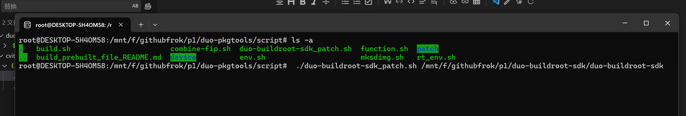
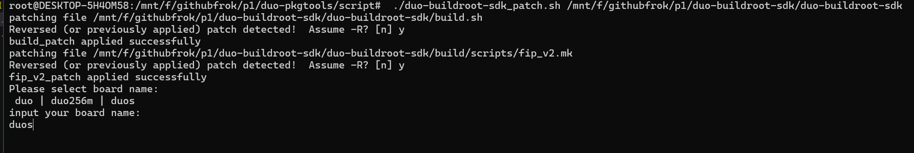
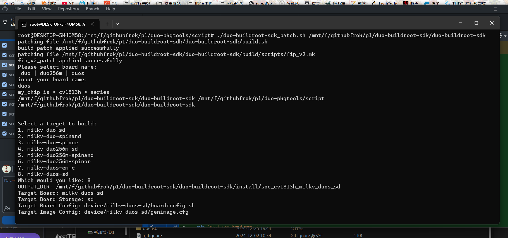
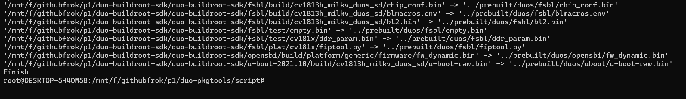
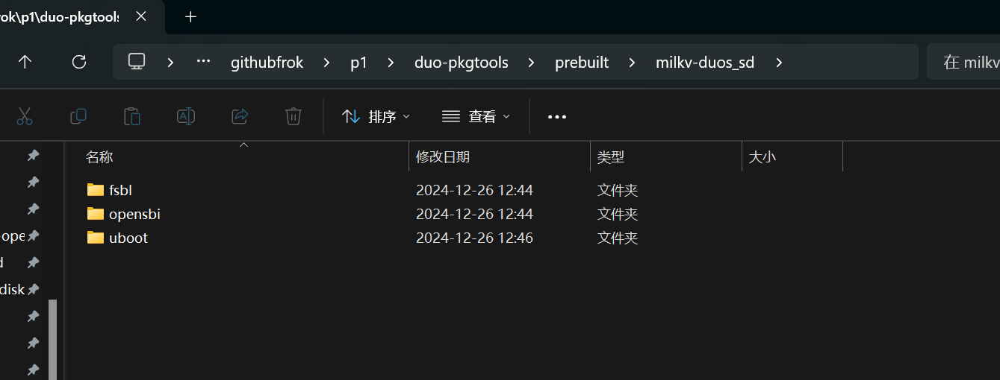

## 运行命令

./duo-buildroot-sdk_patch.sh   参数1必选：duo-buildroot-sdk项目 的绝对路径   参数2可选：开发板名称 duo / duo256 / duos 可选

如果没填 参数2 ， 需要填入 ，如果不填或者填入错误， 默认 duo256m 开发板

选择自己所使用的介质类型 ， 支持 sd \ emmc \ spinand \ spinor \

duo-buildroot-sdk项目编译需要十分钟左右，运行结束，成功复制到 prebuit目录下

